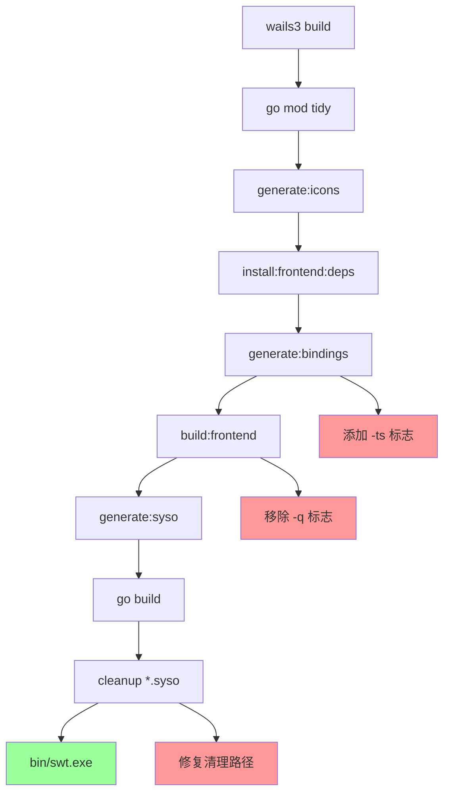

---
tags:
  - wails3
  - typescript
  - build
  - windows
aliases:
  - Wails 3 构建问题修复
created: 2026-04-18
updated: 2026-04-18
status: active
---

> [!abstract] 概述
> 修复 Wails 3 项目在 Windows 平台上的构建错误，包括 TypeScript 绑定生成、Vite 构建标志和 syso 文件清理路径问题，最终成功生成 MSIX 安装包。

## 构建流水线 DAG



## 操作流程

1. **分析构建错误**
   - 识别 TypeScript 声明文件缺失问题
   - 检查 wails3 CLI 帮助文档
   - 定位 Taskfile 配置问题

2. **修复 TypeScript 绑定生成**
   - 在 `build/Taskfile.yml` 的 `generate:bindings` 任务中添加 `-ts` 标志
   - 重新生成绑定，获得 `.d.ts` 声明文件

3. **修复 Vite 构建命令**
   - 移除 `build:frontend` 任务中的 `-q` 标志（vite 不支持）

4. **修复 Windows syso 清理路径**
   - 修改 `build/windows/Taskfile.yml` 的 `build:native` 任务
   - 将清理命令改为从 build 目录执行，使用相对路径 `../*.syso`
   - 添加 `-ErrorAction SilentlyContinue` 避免文件不存在时报错

5. **生成 MSIX 安装包**
   - 运行 `wails3 task package FORMAT=msix`
   - 成功生成安装包

## 关键资料

- Wails 3 CLI 文档：`wails3 generate bindings --help`
- Taskfile 配置文件：`build/Taskfile.yml`、`build/windows/Taskfile.yml`
- 错误日志：TypeScript TS7016 错误、Vite CACError、PowerShell ObjectNotFound

## 代码片段

### 修复 generate:bindings 任务

```yaml
# build/Taskfile.yml
generate:bindings:
  cmds:
    - wails3 generate bindings -ts -f '{{.BUILD_FLAGS}}' -clean=true
```

### 修复 build:frontend 任务

```yaml
# build/Taskfile.yml
build:frontend:
  cmds:
    - bun run {{.BUILD_COMMAND}}  # 移除 -q 标志
```

### 修复 build:native 清理命令

```yaml
# build/windows/Taskfile.yml
build:native:
  cmds:
    - task: generate:syso
    - go build {{.BUILD_FLAGS}} -o "{{.BIN_DIR}}/{{.APP_NAME}}.exe"
    - cmd: powershell Remove-item "..\*.syso" -ErrorAction SilentlyContinue
      dir: build
      platforms: [windows]
    - cmd: rm -f ../*.syso
      dir: build
      platforms: [linux, darwin]
```

## 相关笔记

- 无
